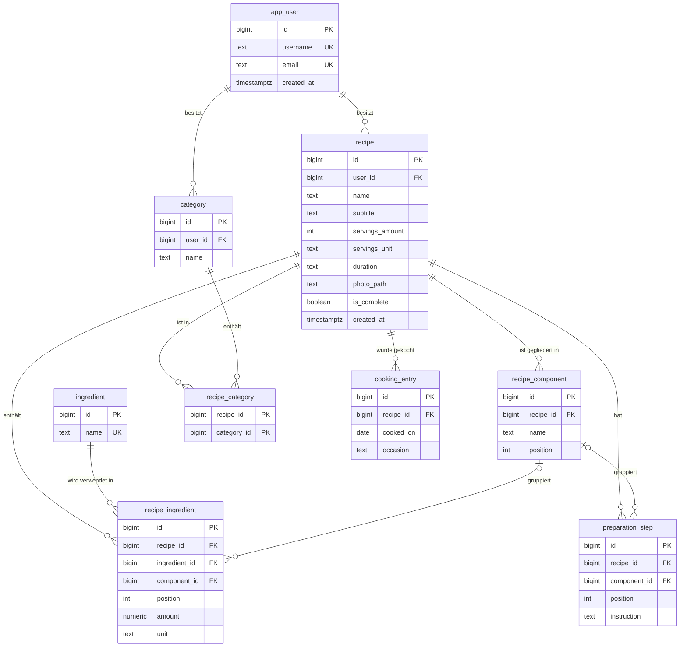

# Datenbank

Beschreibung der Datenbankstruktur von Rezeptoire: welche Tabellen es gibt, was sie tun und warum sie so gebaut sind.

- **Datenbank:** PostgreSQL 18
- **Angelegt durch:** Flyway-Migrationen in `backend/src/main/resources/db/migration`
- **Erste Migration:** `V1__create_tables.sql`

---

## Begriffe

| Begriff | Bedeutung |
|---|---|
| **Primärschlüssel** (`PRIMARY KEY`) | Identifiziert jede Zeile eindeutig. Automatisch `NOT NULL` und `UNIQUE`. |
| **Fremdschlüssel** (`REFERENCES`) | Verweist auf eine Zeile in einer anderen Tabelle. Der Wert muss dort existieren. |
| **`GENERATED ALWAYS AS IDENTITY`** | Postgres vergibt die id selbst und zählt hoch (1, 2, 3 …). |
| **`NOT NULL`** | Pflichtfeld, darf nicht leer sein. |
| **`UNIQUE`** | Wert darf nicht doppelt vorkommen. Mit mehreren Spalten: die *Kombination* darf nicht doppelt vorkommen. |
| **`CHECK (...)`** | Wert muss eine selbst geschriebene Bedingung erfüllen. |
| **`DEFAULT`** | Standardwert, wenn beim Einfügen nichts angegeben wird. |
| **Constraint** | Oberbegriff für Regeln wie `NOT NULL`, `UNIQUE`, `CHECK`, `PRIMARY KEY`. |
| **`ON DELETE CASCADE`** | Wird die verknüpfte Zeile gelöscht, wird diese Zeile mitgelöscht. |
| **`ON DELETE SET NULL`** | Wird die verknüpfte Zeile gelöscht, wird der Fremdschlüssel hier geleert. Die Zeile bleibt. |
| *ohne `ON DELETE`* | Standard: Löschen der verknüpften Zeile wird blockiert, solange diese Zeile darauf verweist. |
| **n:m-Beziehung** | "Viele zu viele", z.B. ein Rezept hat mehrere Kategorien und eine Kategorie mehrere Rezepte. Braucht eine Zwischentabelle. |
| **Label** | Der Text, der in der Oberfläche angezeigt wird. Kann sich vom gespeicherten Wert unterscheiden. |

---

## Übersicht (ER-Diagramm)

Linien zeigen Fremdschlüssel. `||--o{` heißt: eins zu beliebig vielen. `|o--o{` heißt: null oder eins zu beliebig vielen.

---

## Tabellen

### `app_user`

Die Nutzer. Aktuell nur ich, später evtl. mehrere. Ein Passwortfeld kommt erst mit dem Login.

| Spalte | Typ | Regeln | Bedeutung |
|---|---|---|---|
| `id` | `BIGINT` | Primärschlüssel, automatisch | Eindeutige Nummer |
| `username` | `TEXT` | Pflicht, eindeutig | Benutzername |
| `email` | `TEXT` | Pflicht, eindeutig | E-Mail-Adresse |
| `created_at` | `TIMESTAMPTZ` | Pflicht, Standard: jetzt | Wann der Nutzer angelegt wurde |

> `app_user` statt `user`, weil `user` in Postgres ein reserviertes Wort ist.

### `recipe`

Ein Rezept bzw. Gericht. Nur `name` ist Pflicht, damit man Rezepte schnell festhalten und später vervollständigen kann.

| Spalte | Typ | Regeln | Bedeutung |
|---|---|---|---|
| `id` | `BIGINT` | Primärschlüssel, automatisch | Eindeutige Nummer |
| `user_id` | `BIGINT` | Pflicht, → `app_user` | Wem das Rezept gehört |
| `name` | `TEXT` | Pflicht | z.B. "Consommé" |
| `subtitle` | `TEXT` | optional | Kurzbeschreibung, z.B. "Klare Gemüsesuppe" |
| `servings_amount` | `INT` | optional | Menge, z.B. `4` |
| `servings_unit` | `TEXT` | Standard: `'Portionen'` | Einheit, z.B. "Portionen", "Stück", "Bleche" |
| `duration` | `TEXT` | optional, nur erlaubte Werte | Wie lange es dauert (siehe unten) |
| `photo_path` | `TEXT` | optional | Pfad zum Foto |
| `is_complete` | `BOOLEAN` | Pflicht, Standard: `false` | Rezept fertig beschrieben? Wird manuell gesetzt. |
| `created_at` | `TIMESTAMPTZ` | Pflicht, Standard: jetzt | Wann das Rezept angelegt wurde |

**Erlaubte Werte für `duration`:**

| Gespeicherter Wert | Label in der Oberfläche |
|---|---|
| `VERY_QUICK` | sehr fix |
| `QUICK` | fix |
| `MEDIUM` | mittel |
| `LONG` | dauert |
| `VERY_LONG` | dauert lange |

### `ingredient`

Alle Zutaten. Gelten für alle Nutzer gemeinsam, jede Zutat gibt es nur einmal.

| Spalte | Typ | Regeln | Bedeutung |
|---|---|---|---|
| `id` | `BIGINT` | Primärschlüssel, automatisch | Eindeutige Nummer |
| `name` | `TEXT` | Pflicht, eindeutig | z.B. "Tomate" |

### `recipe_component`

Die Komponenten eines Rezepts, also Überschriften zum Gliedern. Bei "Schnitzel mit Kartoffelbrei" sind "Schnitzel" und "Kartoffelbrei" je ein Eintrag. Zutaten und Schritte können auf eine Komponente verweisen. Rezepte ohne Komponenten haben hier einfach keine Einträge.

| Spalte | Typ | Regeln | Bedeutung |
|---|---|---|---|
| `id` | `BIGINT` | Primärschlüssel, automatisch | Eindeutige Nummer |
| `recipe_id` | `BIGINT` | Pflicht, → `recipe`, CASCADE | Zu welchem Rezept |
| `name` | `TEXT` | Pflicht | Die Überschrift, z.B. "Schnitzel" |
| `position` | `INT` | Pflicht | Reihenfolge der Komponenten |

**Beispiel, wie es angezeigt wird:**

> **Zutaten**
> - *Schnitzel*: Schnitzelfleisch, Paniermehl
> - *Kartoffelbrei*: Kartoffeln, Milch
>
> **Schritte**
> 1. Fleisch klopfen (*Schnitzel*)
> 2. Panieren (*Schnitzel*)
> 3. Kartoffeln kochen (*Kartoffelbrei*)

"Zutaten" und "Schritte" sind feste Bereiche der Rezeptseite und stehen nicht in der Datenbank.

### `recipe_ingredient`

Welche Zutat in welchem Rezept in welcher Menge. Hat eine eigene `id`, damit dieselbe Zutat mehrmals in einem Rezept vorkommen kann (z.B. Butter fürs Schnitzel und für den Brei).

| Spalte | Typ | Regeln | Bedeutung |
|---|---|---|---|
| `id` | `BIGINT` | Primärschlüssel, automatisch | Eindeutige Nummer |
| `recipe_id` | `BIGINT` | Pflicht, → `recipe`, CASCADE | Zu welchem Rezept |
| `ingredient_id` | `BIGINT` | Pflicht, → `ingredient`, blockieren | Welche Zutat |
| `component_id` | `BIGINT` | optional, → `recipe_component`, SET NULL | Unter welcher Überschrift |
| `position` | `INT` | Pflicht | Reihenfolge |
| `amount` | `NUMERIC` | optional | Menge, z.B. `0.5` (exakt, ohne Rundungsfehler) |
| `unit` | `TEXT` | optional | Einheit als freier Text, z.B. "g", "EL", "Prise" |

### `preparation_step`

Die Zubereitungsschritte eines Rezepts.

| Spalte | Typ | Regeln | Bedeutung |
|---|---|---|---|
| `id` | `BIGINT` | Primärschlüssel, automatisch | Eindeutige Nummer |
| `recipe_id` | `BIGINT` | Pflicht, → `recipe`, CASCADE | Zu welchem Rezept |
| `component_id` | `BIGINT` | optional, → `recipe_component`, SET NULL | Unter welcher Überschrift |
| `position` | `INT` | Pflicht | Reihenfolge |
| `instruction` | `TEXT` | Pflicht | Der Schritt, z.B. "Fleisch klopfen" |

### `category`

Kategorien wie "Suppen" oder "Vegetarisch". Jede gehört einem Nutzer.

| Spalte | Typ | Regeln | Bedeutung |
|---|---|---|---|
| `id` | `BIGINT` | Primärschlüssel, automatisch | Eindeutige Nummer |
| `user_id` | `BIGINT` | Pflicht, → `app_user` | Wem die Kategorie gehört |
| `name` | `TEXT` | Pflicht | z.B. "Suppen" |

**Zusätzlich:** `UNIQUE (user_id, name)`: Jeder Nutzer kann jeden Namen nur einmal haben, verschiedene Nutzer dürfen aber gleiche Namen haben.

### `recipe_category`

Zwischentabelle für die n:m-Beziehung zwischen Rezepten und Kategorien. Jede Zeile heißt: "Rezept X ist in Kategorie Y".

| Spalte | Typ | Regeln | Bedeutung |
|---|---|---|---|
| `recipe_id` | `BIGINT` | Pflicht, → `recipe`, CASCADE | Das Rezept |
| `category_id` | `BIGINT` | Pflicht, → `category`, CASCADE | Die Kategorie |

**Primärschlüssel:** `(recipe_id, category_id)` zusammen. Dasselbe Paar kann nicht doppelt vorkommen. Keine eigene `id` nötig.

### `cooking_entry`

Der Koch-Tracker: wann welches Rezept gekocht wurde.

| Spalte | Typ | Regeln | Bedeutung |
|---|---|---|---|
| `id` | `BIGINT` | Primärschlüssel, automatisch | Eindeutige Nummer |
| `recipe_id` | `BIGINT` | Pflicht, → `recipe`, CASCADE | Welches Rezept |
| `cooked_on` | `DATE` | Pflicht, Standard: heute | Wann gekocht |
| `occasion` | `TEXT` | optional | Anlass, z.B. "Geburtstag Oma" |

---

## Was passiert beim Löschen?

| Wenn gelöscht wird … | … dann |
|---|---|
| ein **Rezept** | werden seine Komponenten, Zutaten-Einträge, Schritte, Kategorie-Verbindungen und Koch-Einträge mitgelöscht |
| eine **Komponente** | bleiben ihre Zutaten und Schritte im Rezept, nur ohne Überschrift |
| eine **Kategorie** | werden nur die Verbindungen gelöscht, die Rezepte bleiben |
| eine **Zutat** aus `ingredient` | wird blockiert, solange sie in einem Rezept verwendet wird |
| ein **Nutzer** | wird blockiert, solange er Rezepte oder Kategorien hat |

---

## Entscheidungen und Begründungen

| Entscheidung | Begründung |
|---|---|
| **Flyway-Migrationen** statt Tabellen per Hand, einer einzelnen `schema.sql` oder automatischer Erzeugung aus Java | SQL liegt in Git, Änderungen sind nachvollziehbar und laufen ohne Datenverlust auf jedem Rechner und Server gleich. Gilt als Best Practice. |
| **`TEXT` statt `VARCHAR(n)`** | In Postgres gleich schnell, keine erfundenen Längengrenzen. |
| **`IDENTITY` statt `SERIAL`** | Neuere, standardkonforme Schreibweise, gleiches Ergebnis. |
| **`duration` als `TEXT` mit `CHECK`** statt Postgres-Enum oder eigener Tabelle | Die Werte sind fest und ändern sich kaum. Funktioniert mit Java ohne Extra-Einstellungen. Neuer Wert = kleine neue Migration. |
| **Englische Werte für `duration`**, deutsche Labels nur in der Oberfläche | Gespeicherte Werte bleiben stabil, Anzeige-Texte können jederzeit geändert werden. |
| **`is_complete` als manuelles Feld** statt aus den Daten abgeleitet | "Vollständig" ist ein Gefühl, keine feste Regel. Ein Rezept kann Zutaten und Schritte haben und trotzdem noch nicht fertig sein. |
| **Komponenten als eigene Tabelle** statt Textspalte | Überschrift steht nur einmal, Tippfehler erzeugen keine zweite Komponente. Zutaten und Schritte teilen sich dieselben Komponenten. |
| **`ingredient.name` mit einfachem `UNIQUE`** (unterscheidet Groß/Klein) | Das Backend vereinheitlicht die Schreibweise, und beim Tippen werden bestehende Zutaten vorgeschlagen. Kann später per Migration geändert werden. |

**Noch offen:** Ob Schritte strikt nach Komponente gruppiert werden, oder in ihrer eigenen Reihenfolge stehen und die Überschrift bei jedem Wechsel erscheint (dann kann "Schnitzel" mehrmals auftauchen). Betrifft nur die Sortierung im Backend, nicht die Tabellen.

---

## Änderungen an der Struktur

- Bereits gelaufene Migrationsdateien **nie mehr ändern**.
- Jede Änderung ist eine neue Datei mit der nächsten Nummer, z.B. `V2__add_xyz.sql`.
- Dateinamen-Muster: `V` + Nummer + **zwei** Unterstriche + Beschreibung + `.sql`.
- Diese Doku bei jeder Änderung mit anpassen.
